# Лотерейный бэкенд

Бэкенд-система для проведения лотерейных тиражей с покупкой билетов и mock-оплатой.  
Реализован **Сценарий 2: Лотерея с оплатой** согласно учебному кейсу.

## Функциональность

- **Аутентификация и авторизация** (JWT, роли `USER` и `ADMIN`).
- **Управление тиражами** (создание, завершение) — только для `ADMIN`.
- **Покупка лотерейных билетов** пользователями.
- **Mock-оплата билетов** с фиксацией успешного/неуспешного результата.
- **Генерация выигрышной комбинации** при завершении тиража.
- **Автоматическое определение выигрыша** и обновление статусов билетов (`WIN` / `LOSE`).
- **Просмотр истории билетов и результатов** для авторизованных пользователей.

## Технологический стек

- **Java 17**
- **Jetty 11** (встроенный HTTP-сервер, без Spring)
- **PostgreSQL 15**
- **HikariCP** (пул соединений)
- **JWT** (io.jsonwebtoken)
- **BCrypt** (хеширование паролей)
- **Jackson** (JSON-сериализация)
- **Maven** (сборка)
- **Docker / docker-compose** (контейнеризация)

## ER-диаграммма
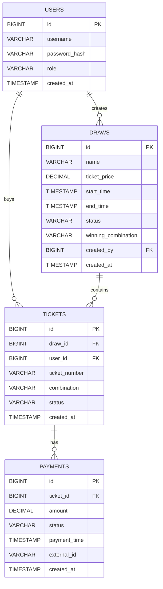

## Запуск приложения

Выполните команду в корне проекта:
   ```bash
   docker-compose up -d
   ```
Сервер запустится на `http://localhost:8080`.

База данных PostgreSQL инициализируется автоматически.

Swagger будет доступен  на `http://localhost:8080/swagger.html`

API приложения описано в openapi.yaml

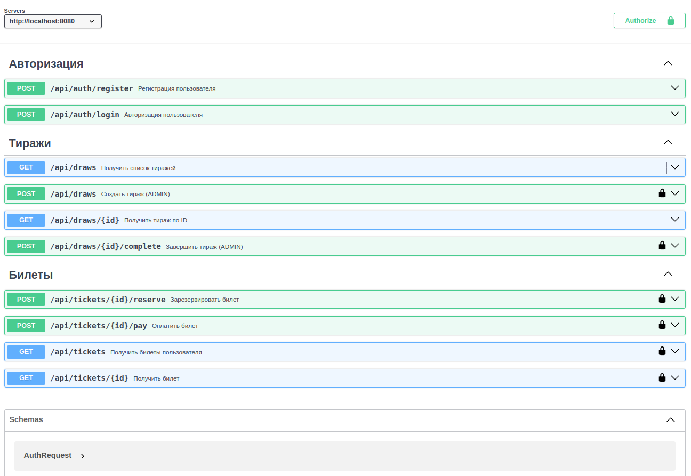

## 🧪 Полный сценарий тестирования

### 1. Вход под администратором (используйте заранее созданного admin/admin123)
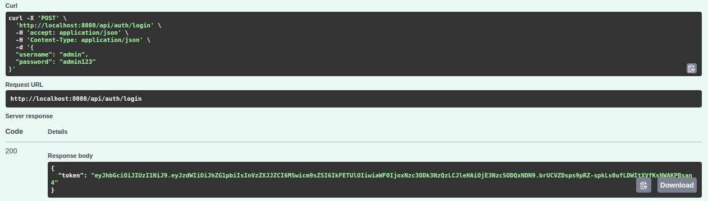

### 2. Создание тиража (ADMIN)
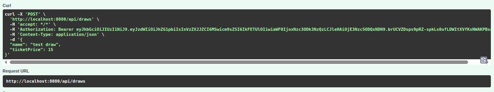
После выполнения метода будет создан тираж в статусе CREATED и 30 билетов в статусе AVAILABLE.

### 3. Регистрация пользователя
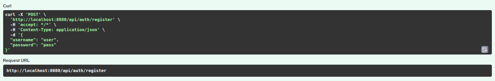

### 4. Вход обычным пользователем
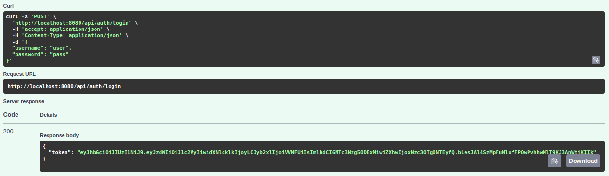

### 5. Получение списка доступных тиражей
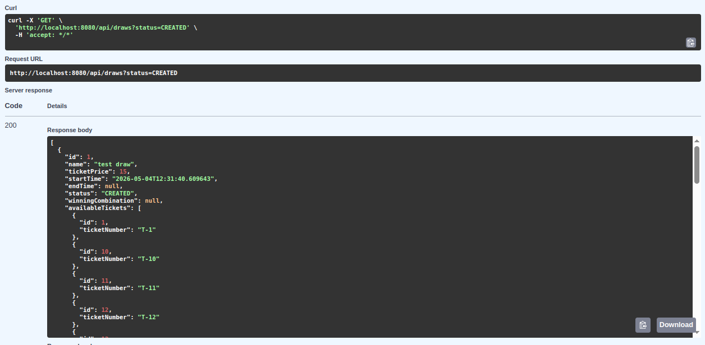

### 5. Резервирование билета за пользователем
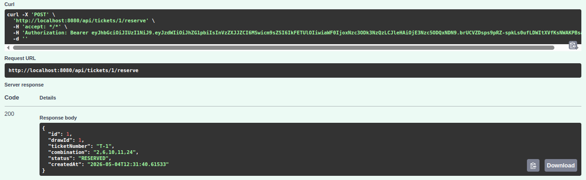
После выполнения метода билет перейдет в статус RESERVED.

### 6. Оплета билета
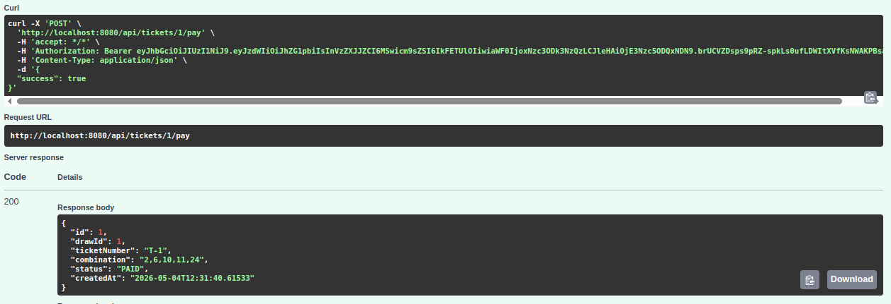
При передаче success = true/false билет перейдет в статус PAID/CANCELLED соответственно.

### 7. Завершение тиража (ADMIN)
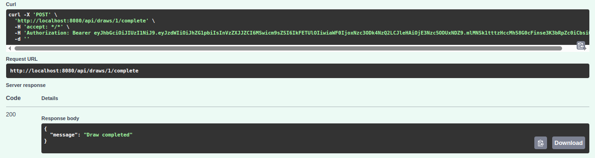

### 8. Проверка результата билетов
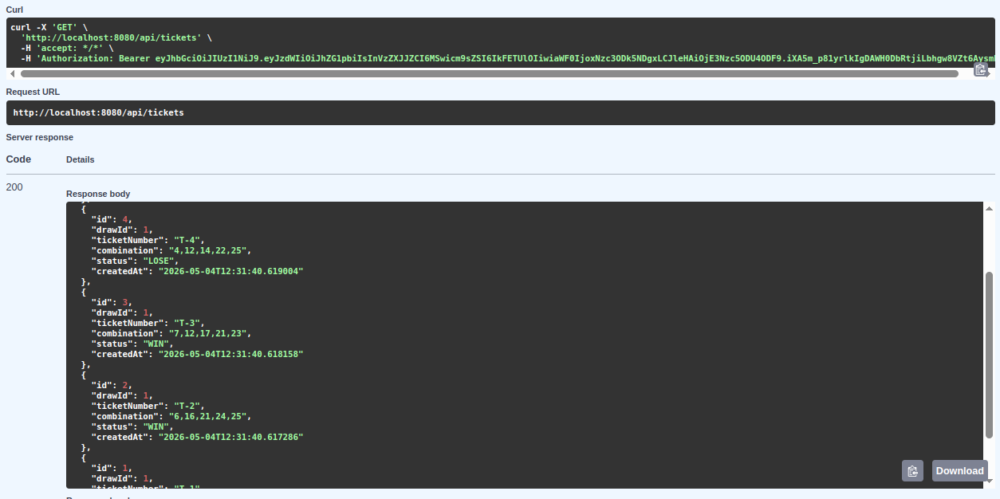
В данной реализации билет считается выигрышным,
если хотя бы одно число из его комбинации оказалось в выигрышной комбинации.

Проверим корректность определения выигрыша, получив информацию о тираже
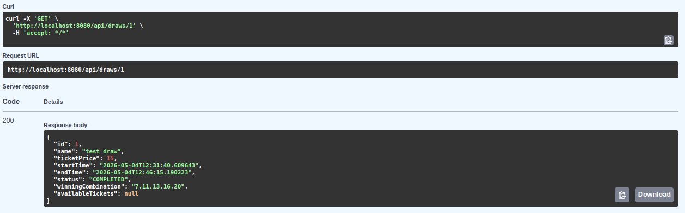

### 9. Просмотр истории тиражей
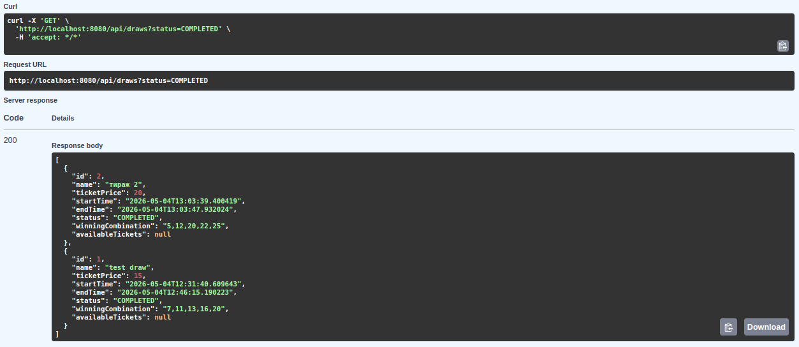

## 📝 Примечания по реализации

- Архитектура разделена на слои: **controller → service → repository**.
- Для работы с БД используется чистый **JDBC** без ORM.
- Транзакции управляются вручную с явными `commit/rollback`.
- Валидация JWT выполняется в `JwtAuthHandler` (наследник `HandlerWrapper`).
- Приложение не использует Spring, что соответствует техническим ограничениям кейса.

## 👥 Авторство

Разработано в рамках учебного хакатона.
```markdown
- @lavrik0904
- @Conststruktor
- @XuTpoKoT
- @Lucy_Korotkova
- @kskskseniia
- @Gertoce
```
