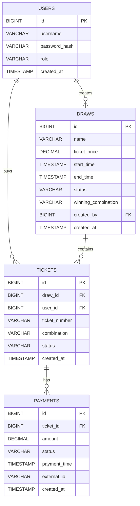

```mermaid
erDiagram
    USERS ||--o{ DRAWS : creates
    USERS ||--o{ TICKETS : buys
    DRAWS ||--o{ TICKETS : contains
    TICKETS ||--o{ PAYMENTS : has

    USERS {
        BIGINT id PK
        VARCHAR username
        VARCHAR password_hash
        VARCHAR role
        TIMESTAMP created_at
    }

    DRAWS {
        BIGINT id PK
        VARCHAR name
        DECIMAL ticket_price
        TIMESTAMP start_time
        TIMESTAMP end_time
        VARCHAR status
        VARCHAR winning_combination
        BIGINT created_by FK
        TIMESTAMP created_at
    }

    TICKETS {
        BIGINT id PK
        BIGINT draw_id FK
        BIGINT user_id FK
        VARCHAR ticket_number
        VARCHAR combination
        VARCHAR status
        TIMESTAMP created_at
    }

    PAYMENTS {
        BIGINT id PK
        BIGINT ticket_id FK
        DECIMAL amount
        VARCHAR status
        TIMESTAMP payment_time
        VARCHAR external_id
        TIMESTAMP created_at
    }
```